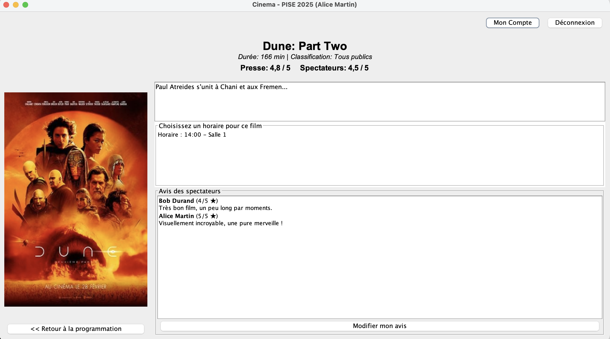

<!-- Language Navigation -->
<div align="right">
  <b><a href="./README.md">English</a></b> | <a href="./README_fr.md">Français</a> | <a href="./README_es.md">Español</a>
</div>

# Java Cinema Management Application

[](https://opensource.org/licenses/MIT)


A comprehensive desktop application for cinema management, developed as a university project. This application, built entirely in **Java** with the **Swing** framework for the UI, provides a complete solution for both customers and cinema administrators. It is structured following a robust **3-tier architecture** and uses **Maven** for project management.



## Table of Contents
- [About The Project](#about-the-project)
- [Key Features](#key-features)
- [Architecture & Design](#architecture--design)
- [Technical Stack](#technical-stack)
- [Getting Started](#getting-started)
- [License](#license)
- [Acknowledgments](#acknowledgments)

## About The Project
This project simulates a complete cinema management system. It features two distinct interfaces:
1.  A **client-facing application** where users can browse movies, view showtimes, book seats, and manage their accounts.
2.  An **administrator dashboard** that provides full control over the cinema's catalog (movies, showtimes, theaters), sales, and staff management.

The primary goal was to apply core software engineering principles, including layered architecture, design patterns (DAO), and manual data integrity management without a relational database system. Data persistence is achieved through Java object serialization into `.dat` files.

## Key Features

### 🎬 Customer Features
- **Account Management:** Users can register, log in, update their information, and delete their accounts.
- **Browse Showtimes:** View a list of available movies and their showtimes, with filtering options (by date, movie title, genre).
- **Interactive Seat Selection:** A graphical interface to choose seats in the theater, with real-time price updates.
- **Booking Process:** A complete booking flow, including adding snacks to the order and a simulated payment process.
- **Reservation History:** Users can view their past and upcoming reservations, and cancel them if needed.
- **Movie Reviews:** Ability to leave and modify ratings and comments for movies.

### ⚙️ Administrator Features
- **Full CRUD Operations:** Administrators can add, modify, and delete movies, genres, showtimes, theaters, and pricing tiers.
- **Snack & Inventory Management:** Manage the catalog of snacks and their stock levels.
- **Point of Sale (POS):** A dedicated interface for employees to handle in-person snack sales.
- **Staff & Schedule Management:** Manage employee accounts, roles, and work schedules.
- **Sales Reporting:** View detailed reports of reservations and snack sales to track business activity.

## Architecture & Design
The application is built upon a classic **3-Tier Architecture** to ensure a clear separation of concerns, making the code modular, maintainable, and scalable.

1.  **Presentation Layer (View):**
    *   Built with **Java Swing**, using NetBeans' graphical editor.
    *   Handles all user interactions through various `JPanel` components managed by `CardLayout` for navigation (client-side) and `JTabbedPane` (admin-side).
    *   It delegates all user actions to the Service layer and contains no business logic.

2.  **Service Layer (Service):**
    *   The functional core of the application. It orchestrates business operations and enforces all business rules (e.g., checking seat availability, validating a password, preventing scheduling conflicts).
    *   Acts as the single point of entry for the View layer and coordinates calls to the Data Access layer.

3.  **Data Access Layer (DAO):**
    *   Responsible for data persistence. Instead of a SQL database, data is persisted by **serializing and deserializing Java objects** into `.dat` files.
    *   This layer implements the **Data Access Object (DAO)** design pattern, abstracting the data source from the rest of the application. This modularity allows the persistence method to be swapped with a SQL database with minimal changes to the other layers.

## Technical Stack
- **Language:** Java 21 (LTS)
- **UI Framework:** Java Swing
- **Build & Dependency Management:** Apache Maven
- **IDE:** Developed in NetBeans

## Getting Started
To run this project, you will need a Java Development Kit (JDK) and Maven installed.

1.  **Prerequisites:**
    *   JDK 21 or higher.
    *   Apache Maven.
    *   A Java IDE that supports Maven projects (e.g., NetBeans, IntelliJ IDEA, Eclipse).

2.  **Clone the repository:**
    ```bash
    git clone https://github.com/Alespfer/cinema-management-app.git
    ```

3.  **Open the project in your IDE:**
    *   Open your IDE and choose "Open Project".
    *   Navigate to the cloned directory and select it. The IDE should automatically recognize it as a Maven project and resolve the dependencies.

4.  **Run the application:**
    *   The project contains a `DataInitializer.java` class that automatically populates the system with sample data (movies, users, etc.) on the first run if the `/data` directory is missing.
    *   Find the main class of the client application (e.g., `FenetrePrincipaleClient.java`) and run it from your IDE.


## Acknowledgments
- This project was developed by Alberto ESPERON and Axelle MORICE.
- Part of the Master's program "Projets Informatiques et Stratégie d'Entreprise (PISE)" at Université Paris Cité.

## Contact

Alberto Esperon - [LinkedIn](https://www.linkedin.com/in/alberto-espfer) - [GitHub Profile](https://github.com/Alespfer)

## License

Distributed under the MIT License. See the `LICENSE` file for more information.
